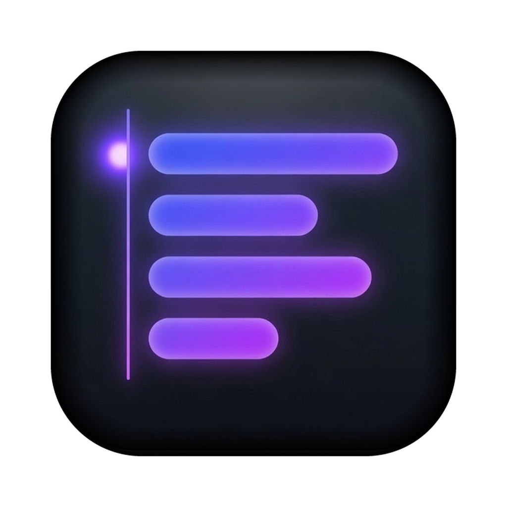
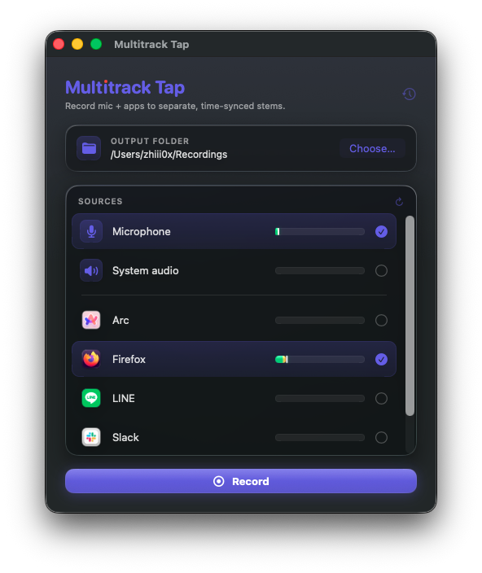

<div align="center">



# Multitrack Tap

**免費、開源、原生的 macOS 多軌錄音工具。**

一鍵把你的**麥克風 + 系統音訊 + 每個指定的 app** 分別錄成**時間同步的獨立 WAV 分軌**,
還直接產生一個**可立即打開的 Reaper 專案**。

[English](README.md) · 繁體中文


<br>



</div>

---

## 這是什麼

Multitrack Tap 一鍵就能把你 Mac 上的每個音源,各自錄成一條乾淨的分軌:

- 你的**麥克風**、**系統音訊**、以及**每個指定的 app**(Zoom、Discord、瀏覽器分頁、音樂播放器、遊戲)——每個都錄成**自己的一條分軌**
- 建立在**原生 Core Audio process taps**(macOS 14.4+)之上——**不用安裝任何虛擬音訊驅動**
- 分軌**取樣級對齊**、**全部歸零到專案起點**,完美對齊、不用手動微調
- 一鍵還會寫出一個**可立即打開的 Reaper 專案**,每條軌道依音源命名、全部對齊;當然也可以直接把分軌拖進任何 DAW 或剪輯軟體

免費、開源、原生於 macOS。

## 適合用在

- **直播**——把遊戲/app 聲音、系統音訊、你的麥克風分別錄成獨立分軌,直播之餘還能事後乾淨地重剪或二次利用。
- **Podcast 與遠端訪談**——麥克風、遠端來賓(Zoom、Discord、Riverside)、背景音樂各自一條分軌,所以「來賓太大聲」或「音樂要 ducking」在後製一分鐘就能修。
- **會議與通話**——錄下任何會議軟體,把各方與系統音訊分軌保存,方便做會議記錄、剪精華、或轉逐字稿。
- **教學影片與線上課程**——旁白獨立成一條分軌,跟 app、系統音訊分開,直接丟進 DAW 或剪輯軟體。

## 功能

- 麥克風 + 系統音訊 + N 個 app 分軌,對齊到**同一個參考時脈**一起擷取
- WAV 輸出:**16 / 24 / 32-bit**(預設 32-bit float,不爆音),取樣率 **44.1 / 48 / 88.2 / 96 kHz**
- **一鍵 Reaper `.rpp`** 匯出——軌道依音源命名,全部對齊到 0
- 即時電平表 + 選單列快速 **開始/停止**
- 可錄任意組合的音源——每個音源各自請求權限,且若某個音源無法擷取,會自動略過、其餘照常錄音
- 中斷也不怕——錄音中會定期回寫 WAV header,下次啟動時自動修復,所以即使當機也留下可正常播放的分軌

## 系統需求

- macOS **14.4(Sonoma)** 以上——Core Audio process taps 必需
- Apple Silicon 或 Intel 皆可

## 目前狀態

**開發中(尚未正式發佈)。** 錄音引擎、UI、Reaper 匯出都已可運作。已簽章與公證的 DMG
以及 Homebrew cask 在規劃中。目前請**從原始碼自行建置**。

## 從原始碼建置

```bash
git clone https://github.com/zhiii0x/MultitrackTap.git
cd MultitrackTap

# 跑純邏輯核心的單元測試
swift test

# 建置並組裝 .app
cd app
./make-app.sh
open "Multitrack Tap.app"
```

第一次錄音時,app 會請求**麥克風**與**系統音訊錄製**權限。使用 ad-hoc 簽章時,音訊擷取的授權
會在每次重新建置後失效——設定一個穩定簽章身分就能讓授權跨建置保留:

```bash
SIGN_ID="Developer ID Application: Your Name (TEAMID)" ./make-app.sh
```

完整使用說明(錄音、設定、輸出、疑難排解)見 **[使用手冊](MANUAL.zh-TW.md)**。

## 運作原理

一個純粹、完整單元測試過的 Swift 套件(**`MultitrackCore`**)裝著所有邏輯——WAV 寫入、時間軸
對齊、Reaper 匯出——全部藏在 `AudioTap` protocol 介面後面。一層輕薄的 **SwiftUI app** 提供真正的
Core Audio process taps、麥克風擷取、音源列舉與 UI。每個音源都以同一個 host-time 參考時脈標記時間,
`TimelineAligner` 會在前面補上靜音,讓每條分軌都從專案時間 0 開始——這就是分軌能對齊的關鍵。

本專案的 Core Audio process-tap 與音源列舉程式碼改寫自 AudioCap(詳見下方〈致謝〉)。

## 參與貢獻

歡迎開 issue 與 PR。錄音邏輯請放在 `MultitrackCore`(以 `swift test` 測試先行開發);硬體與 UI
相關的放在 app 層。

## 致謝

特別感謝 **[Guilherme Rambo](https://github.com/insidegui)**。他的開源專案
**[AudioCap](https://github.com/insidegui/AudioCap)** 讓本專案的 Core Audio
process-tap 得以實現——Multitrack Tap 的 tap 設定與音源列舉即改寫自它,
採用 [BSD-2-Clause 授權](THIRD-PARTY-LICENSES.md)。Guilherme,謝謝你。

## 授權

[MIT](LICENSE) © 2026 Zhiii
